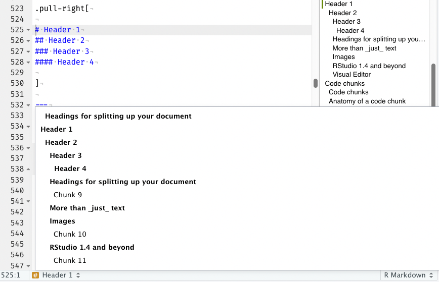
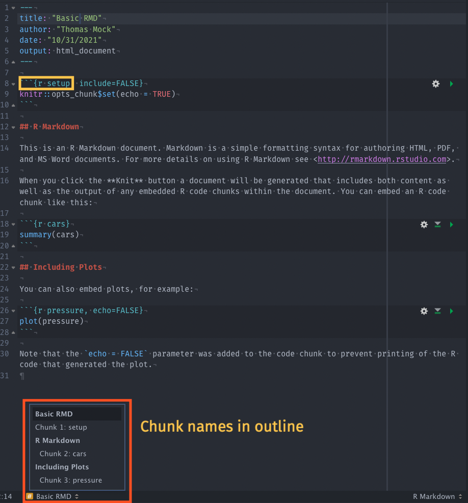
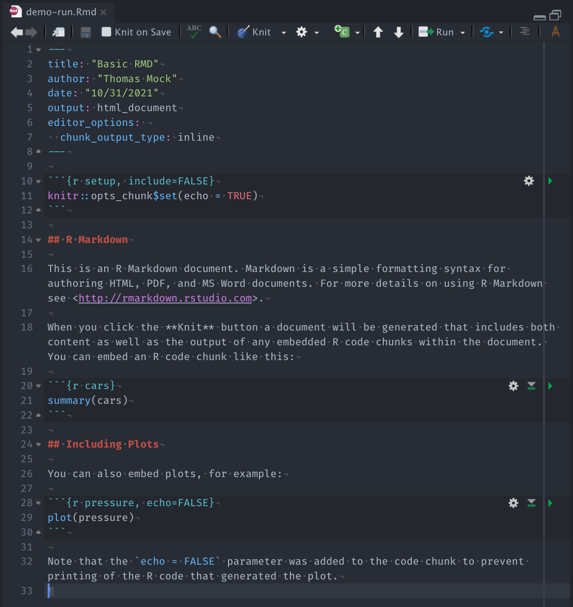
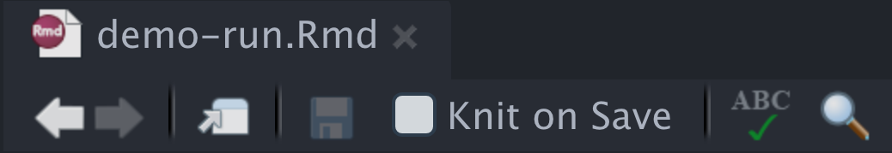
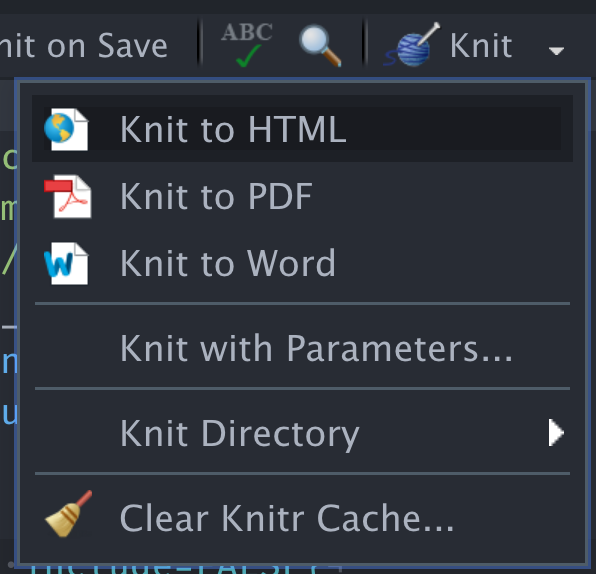
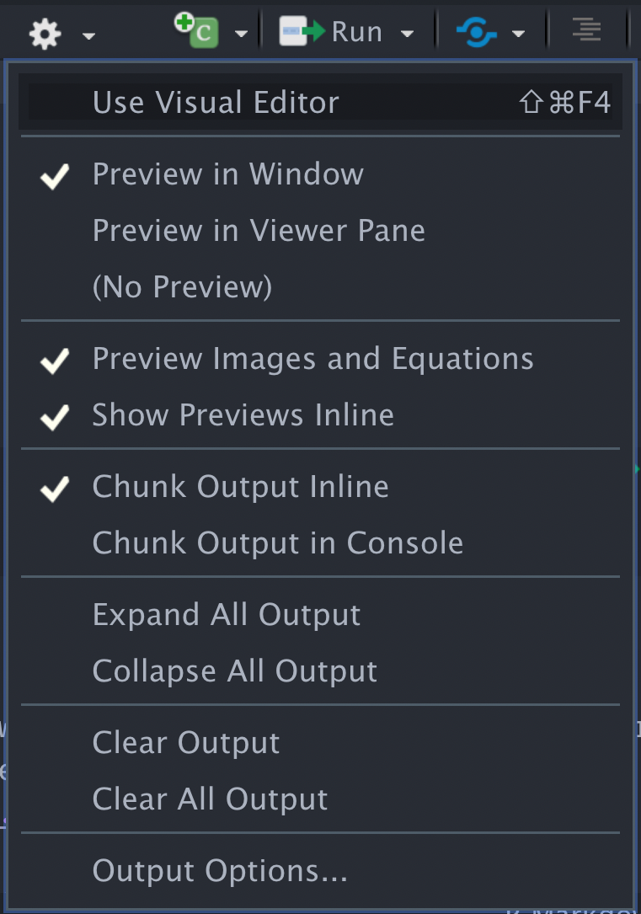
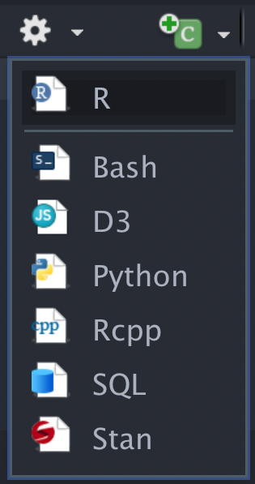
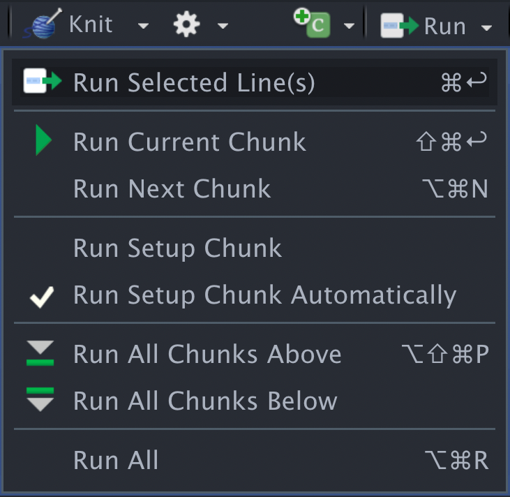
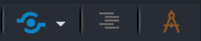

```{r, include=FALSE}
options(htmltools.dir.version = FALSE,
        eval = TRUE, echo = TRUE)
library(tidyverse)
library(gt)
library(glue)
```

```{r metathis, echo=FALSE}
library(metathis)
meta() %>%
  meta_name("github-repo" = "jthomasmock/rmd-nhs") %>% 
  meta_social(
    title = "RMarkdown for reproducible reporting",
    description = 
      "An introduction to the RMarkdown package for reproducible reporting in RStudio",
    url = "https://jthomasmock.github.io/rmd-nhs/",
    image = "https://images.unsplash.com/photo-1603204254626-d0de8eb24cf1?ixid=MnwxMjA3fDB8MHxwaG90by1wYWdlfHx8fGVufDB8fHx8&ixlib=rb-1.2.1&auto=format&fit=crop&w=1471&q=80",
    og_type = "website",
    og_author = "Tom Mock",
    twitter_card_type = "summary_large_image",
    twitter_creator = "@thomas_mock",
    twitter_site = "@thomas_mock"
  )
```

class: title-slide, left, top

# `r rmarkdown::metadata$title`:

## `r rmarkdown::metadata$subtitle`

### `r rmarkdown::metadata$author`

### `r Sys.Date()`

`r fontawesome::fa("github", "white")` [github.com/jthomasmock/rmd-nhs/](https://github.com/jthomasmock/rmd-nhs/tree/master/workshop)

`r fontawesome::fa("link", "white")` [jthomasmock.github.io/rmd-nhs/index.html](https://jthomasmock.github.io/rmd-nhs/index.html)   

<span style='color:white;'>Slides released under</span> [CC-BY 2.0](https://creativecommons.org/licenses/by/2.0/)&nbsp;&nbsp;`r fontawesome::fa("creative-commons", "white")``r fontawesome::fa("creative-commons-by", "white")` ]   

<div style = "position: absolute;top: -50px;right: -200px;"></img></div>

<div style = "position: absolute;bottom: 5px;right:25px;font-size:8px;color:white;">Image Credit: Bruno Martins, unsplash.com/photos/OhJmwB4XWLE</div>

---

layout: true

<div class="my-footer"><span>jthomasmock.github.io/rmd-nhs/</span></div>

---

# Resources

### Workshop materials: [on Github](https://github.com/jthomasmock/rmd-nhs/tree/master/workshop)

### Slides: [jthomasmock.github.io/rmd-nhs/](https://jthomasmock.github.io/rmd-nhs/)

Some content adapted from superstar Dr. Alison Hill [CDC](https://www.apreshill.com/talk/2020-rmd4cdc/) & [R4Pharma](https://rmd4pharma.netlify.app/): CC-BY

---

### What is R Markdown?

1. ["An authoring framework for data science."](https://rmarkdown.rstudio.com/lesson-1.html) (✔️)  

1. [A document format (.Rmd).](https://bookdown.org/yihui/rmarkdown/) (✔️)  

1. [An R package named rmarkdown.](https://rmarkdown.rstudio.com/docs/) (✔️)  

1. ["A file format for making dynamic documents with R."](https://rmarkdown.rstudio.com/articles_intro.html) (✔️)  

1. ["A tool for integrating text, code, and results."](https://r4ds.had.co.nz/communicate-intro.html) (✔️)  

1. ["A computational document."](http://radar.oreilly.com/2011/07/wolframs-computational-documen.html) (✔️)  

--

1. Magic (🧙️)  

---

background-image: url("https://raw.githubusercontent.com/allisonhorst/stats-illustrations/master/rstats-artwork/rmarkdown_wizards.png")
background-position: center
background-size: contain

---

### Why RMarkdown?

1. Reproducibility

--

2. Re-usability

--

3. Extensibility

--

4. "Lazy" ability

---

### Change your mental model

.pull-left[
#### Source <-> Output

```{r, echo=FALSE, out.width="50%"}
knitr::include_graphics("images/word.png")
```

]

--

.pull-right[

#### Source -> Output

```{r, echo=FALSE, out.width="50%"}
knitr::include_graphics("images/rmd-file.png")
```

]

---

### R Markdown

> R Markdown documents are fully reproducible. Use a productive notebook interface to weave together narrative text and code to produce elegantly formatted output. Use multiple languages including R, Python, and SQL.

--

No more copy-paste, no more manually rebuilding analyses from disparate components, no more dread when the data is updated and you need to run an analysis.

---

background-image: url("https://images.unsplash.com/4/madebyvadim.jpg?ixid=MnwxMjA3fDB8MHxwaG90by1wYWdlfHx8fGVufDB8fHx8&ixlib=rb-1.2.1&auto=format&fit=crop&w=1469&q=80")
background-position: center
background-size: fill
class: center, middle

--

<h1 style='color:black;background-color: rgba(255,255,255,0.75);padding:5px;line-height:2em;'>Ease of Use VS Full Details</h1>

---

### Pouring milk

A straight-forward task - pour the boxed milk into the glass.

--

.pull-left[

> Easy to use  


]

--

.pull-right[

> Understanding the Full details  


]

---


```{r, echo = FALSE}
table_data <- tibble::tribble(
        ~section,              ~name,                                          ~desc,                                                                   ~url,
     "Documents",         "Notebook",                      "Interactive R Notebooks",                   "https://bookdown.org/yihui/rmarkdown/notebook.html",
     "Documents",             "HTML",               "HTML document w/ Bootstrap CSS",              "https://bookdown.org/yihui/rmarkdown/html-document.html",
     "Documents",              "PDF",            "PDF document (via LaTeX template)",               "https://bookdown.org/yihui/rmarkdown/pdf-document.html",
     "Documents",             "Word",               "Microsoft Word document (docx)",              "https://bookdown.org/yihui/rmarkdown/word-document.html",
     "Documents",              "ODT",                   "OpenDocument Text document", "https://bookdown.org/yihui/rmarkdown/opendocument-text-document.html",
     "Documents",              "RTF",                    "Rich Text Format document",  "https://bookdown.org/yihui/rmarkdown/rich-text-format-document.html",
     "Documents",         "Markdown",          "Markdown document (various flavors)",          "https://bookdown.org/yihui/rmarkdown/markdown-document.html",
 "Presentations",         "ioslides",              "HTML presentation with ioslides",      "https://bookdown.org/yihui/rmarkdown/ioslides-presentation.html",
 "Presentations",        "reveal.js",             "HTML presentation with reveal.js",                   "https://bookdown.org/yihui/rmarkdown/revealjs.html",
 "Presentations",            "Slidy",             "HTML presentation with W3C Slidy",         "https://bookdown.org/yihui/rmarkdown/slidy-presentation.html",
 "Presentations",           "Beamer",           "PDF presentation with LaTeX Beamer",        "https://bookdown.org/yihui/rmarkdown/beamer-presentation.html",
 "Presentations",       "PowerPoint",                      "PowerPoint presentation",    "https://bookdown.org/yihui/rmarkdown/powerpoint-presentation.html",
      "Journals",          "distill", "Scientific and technical writing for the web",                                   "https://rstudio.github.io/distill/",
      "Journals",      "jss_article",        "Journal of Statistical Software (JSS)",                                   "https://github.com/rstudio/rticles",
      "Journals",      "acm_article",    "Association for Computing Machinery (ACM)",                                   "https://github.com/rstudio/rticles",
      "Journals",      "acs_article",      "American Chemical Society (ACS) Journal",                                   "https://github.com/rstudio/rticles",
      "Journals",             "ctex",    "Documents based on the LaTeX package ctex",                                   "https://github.com/rstudio/rticles",
      "Journals", "elsevier_article",             "Submissions to Elsevier journals",                                   "https://github.com/rstudio/rticles",
          "More",    "flexdashboard",                       "Interactive dashboards",                                             "flexdashboard/index.html",
          "More",         "bookdown",            "HTML, PDF, ePub, and Kindle books",                                                 "https://bookdown.org",
          "More",         "Websites",                          "Multi-page websites",             "https://bookdown.org/yihui/rmarkdown/rmarkdown-site.html",
          "More",         "blogdown",              "Customizable websites and blogs",                                 "https://bookdown.org/yihui/blogdown/",
          "More",          "pkgdown",               "Package documentation websites",                                           "https://pkgdown.r-lib.org/",
          "More",    "Tufte Handout",        "Handouts in the style of Edward Tufte",             "https://bookdown.org/yihui/rmarkdown/tufte-handouts.html",
          "More", "Package Vignette",                    "R package vignette (HTML)",         "https://bookdown.org/yihui/rmarkdown/r-package-vignette.html",
          "More",  "Github Document",           "GitHub Flavored Markdown document.",                                          "github_document_format.html"
 )

paste_table <- function(sections = c("Documents", "Presentations")){
  table_data %>% 
    filter(section %in% sections) %>% 
    gt(groupname_col = "section", rowname_col = "name") %>% 
    gtExtras::gt_theme_nytimes() %>% 
    text_transform(
      locations = cells_stub(),
      fn = function(x){
        raw_url <- gtExtras::gt_index(., url)
        
        map2(x,raw_url, function(xy, url){
          gt::html(
            glue::glue(
              "<a href ='{url}' style='text-decoration:none;' target='_blank'>
              {xy}</a>"
            )
          )
        })
      }
    ) %>% 
    cols_hide(url) %>% 
    cols_label(desc = "") %>% 
    opt_table_lines("none") %>% 
    tab_style(
      locations = cells_row_groups(),
      style = list(
        cell_borders("bottom", "black", weight = px(3)),
        cell_text(weight = "bold", color = "black"),
        cell_fill(color = "lightgrey")
      )
    ) %>% 
    tab_style(
      locations = cells_stub(),
      style = cell_text(font = google_font("Fira Mono"))
    ) %>% 
    opt_table_font(font = google_font("Open Sans"))
}
```

.pull-left[

### Many [RMarkdown Formats](https://rmarkdown.rstudio.com/formats.html)

```{r, echo = FALSE}
paste_table()
```

]

--

.pull-right[
```{r, echo = FALSE}
paste_table(c("Journals", "More"))
```

]

---

### Anatomy of RMarkdown

- Metadata (YAML)

```
---
output: html_document
---
```

--

- Code

````md

```{r basicExample, echo = TRUE}`r ''`
library(dplyr)
mtcars %>% 
  group_by(cyl) %>% 
  summarize(n = n(), mean = mean(mpg))
```

````

--

- Text

```
# Heading 1
This is a sentence with some **bold text**, some *italic text* and an [image](image.png).
```
---

### Metadata: YAML

The [YAML](https://yaml.org/) metadata or header is:

> processed in many stages of the rendering process and can influence the final document in many different ways. It is placed at the very beginning of the document and is read by each of Pandoc, rmarkdown, and knitr. Along the way, the information that it contains can affect the code, content, and the rendering process. - [RMarkdown Cookbook](https://bookdown.org/yihui/rmarkdown-cookbook/rmarkdown-anatomy.html)

--

A generic YAML follows a pattern like the below:

```
---
key: value
---
```

Valid YAML requires 3 dashes `---` on either end, creating the YAML block, with `key` + `value` pairs assigned throughout.

---

### Metadata: YAML

Specific metadata about the document and rendering options are included in this YAML header.

Note that if you want to find out what type of options are available, you can run `?rmarkdown::html_document()` or `?rmarkdown::pdf_document()`, etc, to show the specific rendering options for _that_ specific output format. There is also a [`rmarkdown` `pkgdown` site](https://rmarkdown.rstudio.com/docs/reference/html_document.html), so you can explore specific options there as well.


---


### Output options

```
---
output: html_document
---
```

```{r, echo=FALSE, fig.alt="Image of the letter R slightly tilted, along with the various RMarkdown outputs scattered around it. It includes HTML logo, PDF, a report, a dashboard, Word, Tufte, ePUB, kindle and LATEX", out.width = "30%"}
knitr::include_graphics("https://d33wubrfki0l68.cloudfront.net/aee91187a9c6811a802ddc524c3271302893a149/a7003/images/bandthree2.png")
```


---

### Specify output options in YAML

.pull-left[
```
---
title: My First RMarkdown Report
author: Tom Mock
output: html_document
---
```

]

---

### Specify output options in YAML

.pull-left[
```
---
title: My First RMarkdown Report
author: Tom Mock
output: html_document
---
```

```
---
title: My First RMarkdown Report
author: Tom Mock
output:
  html_document:
    toc: true
    toc_float: true
    theme: united
    code_download: true
---
```

]

--

.pull-right[
```
---
title: My PDF RMarkdown Report
author: Tom Mock
output: pdf_document
---
```

]

---

### Specify output options in YAML

.pull-left[
```
---
title: My First RMarkdown Report
author: Tom Mock
output: html_document
---
```

```
---
title: My First RMarkdown Report
author: Tom Mock
output:
  html_document:
    toc: true
    toc_float: true
    theme: united
    code_download: true
---
```

]

.pull-right[
```
---
title: My PDF RMarkdown Report
author: Tom Mock
output: pdf_document
---
```

```
---
title: "My Presentation"
subtitle: "made with xaringan"
author: "Yihui Xie"
date: "2021-10-30"
output:
  xaringan
---
```

]

---

class: inverse, center, middle

# Text

---

### Text and Markdown text

* _Text_ is **human language**  

* _Markdown_ is **markup language**  

--

```
* _Text_ is **human language**  

* _Markdown_ is **markup language**
```

--

You can read all about Markdown via the [Markdown guide](https://www.markdownguide.org/) or use the [`rmarkdown` cheat sheet](https://github.com/rstudio/cheatsheets/blob/master/rmarkdown-2.0.pdf)!

---

### Headings for splitting up your document

.pull-left[
```
# Header 1


## Header 2


### Header 3


#### Header 4
```

]

--

.pull-right[

# Header 1
## Header 2
### Header 3
#### Header 4

]

---

### Headings for splitting up your document

```{r, echo = FALSE, out.width = "65%"}

```


---

### More than _just_ text

You can inline R code, so that you can programatically generate specific components of the document.

--

IE I can report that there are `r knitr::inline_expr("nrow(mtcars)")` 

--

Which returns `r nrow(mtcars)`.

--

These inline texts can be as complex or simple as you like, and can also return R objects.

```{r}
car_rows <- glue::glue("There are {nrow(mtcars)} rows in the `mtcars` dataset.")
```

--

`r knitr::inline_expr("car_rows")` 

--

`r car_rows`


---

.pull-left[

### More than _just_ text

```
Indeed, parents whose children are  
vaccinated no longer have to worry about  
their child's death or disability from:

- whooping cough, 
- polio, 
- diphtheria, 
- hepatitis, or 
- a host of other infections.

Vaccines are the most cost-effective health  
care interventions there are. We have   
three new, extremely effective vaccines to  
roll out in developing countries:  

1. pneumonia
1. rotavirus
1. meningitis A
```

]

--

.pull-right[


Indeed, parents whose children are  
vaccinated no longer have to worry about  
their child's death or disability from:  

- whooping cough, 
- polio, 
- diphtheria, 
- hepatitis, or 
- a host of other infections.

Vaccines are the most cost-effective health  
care interventions there are. We have   
three new, extremely effective vaccines to  
roll out in developing countries:  

1. pneumonia
1. rotavirus
1. meningitis A

]

---

### Images

.pull-left[

```


```


]

--

.pull-right[

```{r, out.width="30%"}
knitr::include_graphics("https://user-images.githubusercontent.com/163582/45438104-ea200600-b67b-11e8-80fa-d9f2a99a03b0.png")
```


]

---

.pull-left[

### RStudio 1.4 and beyond

RStudio v1.4 (and future versions) include a visual markdown editing mode. Write code, text, and markdown. See the results in real time!

]

.pull-right[
```{r, echo = FALSE, out.width="100%", fig.alt="A screenshot showing the conversion of markdown into it's formatted output inside the RStudio IDE", fig.align="center"}
knitr::include_graphics("https://rstudio.github.io/visual-markdown-editing/images/visual-editing.png")
```


]

---

### Visual Editor

* The visual editor is more than _just_ the ability to see the output in real time.  
* It also provides "word processor" like formatting of text, math, and other capabilities!  


```{r, echo = FALSE, out.width="60%", fig.alt="A screenshot of a RMarkdown document inside the RStudio visual editor. It highlights the text processing abilities and shortcuts.", fig.align="center"}
knitr::include_graphics("https://rstudio.github.io/visual-markdown-editing/images/visual-editing-math.png")
```

---

class: inverse, middle, center

# Code chunks

---

### Code chunks

Specified sections of the document that are used to evaluate code and optionally return outputs.

.pull-left[

````md
```{r, echo = FALSE}`r ''`
mtcars %>% 
  distinct(cyl)
```

````

]

--

.pull-right[

```{r, echo = TRUE}
mtcars %>% 
  distinct(cyl)
```


]

---

### Anatomy of a code chunk

.pull-left[

````md
```{r car-stuff, echo = FALSE}`r ''`
mtcars %>% 
  distinct(cyl)
```

````

]

--

.pull-right[
- Has 3x backticks on each end ```` ``` ````  
- Place engine (`r` and chunk label `label`) between curly braces `{r label}`  
- Place options behind the label, after a comma: `{r label, option1=value}`  

]
---

### Code chunks

Code in a chunk auto print, unless saved to an object, which needs to be explicitly returned.

```{r}
n_manufacturers <- n_distinct(gt::gtcars$mfr)
```

--

```{r}
n_manufacturers
```


--

```{r}
n_manufacturers <- n_distinct(gt::gtcars$mfr)
n_manufacturers
```

---

### Code chunks return more than just data

.pull-left[
```{r}
car_data <- gt::gtcars %>% 
  filter(!is.na(mpg_h)) %>% 
  group_by(mfr) %>% 
  summarise(
    mean_mpg = mean(mpg_h), 
    n_models = n_distinct(model)
    ) %>% 
  filter(n_models >= 2) %>% 
  arrange(desc(n_models))
```

```{r plotEx, fig.dim = c(4,6), dpi = 150, eval = FALSE}
ggplot(car_data, aes(x = mean_mpg, 
      y = fct_reorder(mfr, mean_mpg))) +
  geom_col()
```

]

--

.pull-right[

```{r plotEx, fig.dim = c(4,6), dpi = 150, eval = TRUE}
```

]

---

### Code chunks return more than just data

```{r}
car_data %>% 
  gt::gt()
```

---

### Code chunks are controllable

There are many chunk options you can control via `knitr` (the package that provides core features of RMarkdown).

Link to all the [`knitr` options](https://yihui.org/knitr/options/#code-chunk)  

--


.pull-left[

````md
```{r, eval = FALSE}`r ''`
mtcars %>% 
  distinct(cyl)
```
````


]

--

.pull-right[
```{r, eval = FALSE}
# This won't return, because the 
# chunk is not evaluated
# via eval = FALSE
mtcars %>% 
  distinct(cyl)
```


]

---

### Code chunks are controllable

Some examples

| Option      | Description |
| ----------- | ----------- |
| `fig.dim = c(4,6)`      | Plots generated from this chunk will have a width of 4 and height of 6. |
| `dpi = 150`   | Plots generated will have a dots per inch (pixel density) of 150 |
| `echo = FALSE` | Code will not be echoed (ie not shown) |
| `eval = FALSE` | Nothing will be evaluated, but could still be printed |
| `cache = TRUE` | Results will be cached, and chunk will not be run in subsequent renders, unless code is changed. | 
| `message = FALSE` | No messages will be printed |
| `warning = FALSE` | No warnings will be printed | 
| `include = FALSE` | No ouputs/echo/messages/etc will be returned | 


---

### Code chunks are controllable

````md
```{r, fig.dim = c(6,4), dpi=150}`r ''`
mtcars %>% 
  count(cyl) %>% 
  ggplot(aes(x = n, y = factor(cyl))) + geom_col()
```
````

--

New to `knitr` v1.35, there's now support for in-chunk option setting via special chunk option comments (ie `#|`). Very useful for longer options (like `fig.cap` or `fig.alt`), for setting many chunks at once, or for logical statements.

````md
```{r}`r ''`
#| fig.dim = c(6,4), dpi = 150,
#| fig.alt = "A simple barplot with the count of observations on the x-axis by the number of cylinders on the y-axis. There are 14 eight-cylinder cars, 7 six-cylinder cars, and 11 four-cylinder cars.\n
```
````


---

### Code chunks are controllable

.pull-left[

Default plot, too big and "fuzzy" 

```{r}
mtcars %>% 
  count(cyl) %>% 
  ggplot(aes(x = n, y = factor(cyl))) + geom_col()
```


]

--

.pull-right[

opts set: `fig.dim = c(6,4)` and `dpi=150`

```{r, fig.dim = c(6,4), dpi=150}
mtcars %>% 
  count(cyl) %>% 
  ggplot(aes(x = n, y = factor(cyl))) + geom_col()
```

]

---

### Chunk options can be globally set

````md
```{r setup, include = FALSE}`r ''`
knitr::opts_chunk$set(
  echo = FALSE, fig.width = 6, dpi = 150
)
```
````

--

This is typically most useful in avoiding repeating yourself throughout a document and making the different components consistent between chunks without _having_ to manually set these for **EACH** chunk.

---

### Chunk option defaults

.pull-left[
```{r}
str(knitr::opts_chunk$get()[1:27])
```

]

--

.pull-right[
```{r}
str(knitr::opts_chunk$get()[28:53])
```

]


---

### Chunks can be named

.pull-left[
* Useful for managing your longer documents (RStudio outline)  

```{r, echo = FALSE, out.width="80%"}
#| fig.alt="A screenshot of a RMarkdown document inside RStudio. The screenshot highlights the automatically generated document outline for each chunk name."

```

]

--

.pull-right[
* Useful for troubleshooting (ie _where_ is the document failing on render)  

```
label: unnamed-chunk-23
  |..............................|  83%
  ordinary text without R code

  |..............................|  85%
label: unnamed-chunk-24 (with options) 
List of 2
 $ fig.dim: num [1:2] 6 4
 $ dpi    : num 150

  |..............................|  86%
  ordinary text without R code
```

]


---

### Named chunks can be re-used!

.pull-left[
````md

```{r myPlt, eval = FALSE}`r ''`
ggplot(mtcars, aes(x = disp, y = mpg, 
    color = factor(cyl))) +
  geom_point()
```

````

Note that you when using **named chunks** you can't alter the internal code, only the chunk options. This is necessary because you are referencing the initially defined code in that chunk.

]

--

.pull-right[
````md
```{r myPlt, dpi=300,fig.dim=c(6,4)}`r ''`
```
````

```{r coolPlot, echo = FALSE, dpi=300, fig.dim = c(6,4)}
ggplot(mtcars, aes(x = disp, y = mpg, color = factor(cyl))) +
  geom_point()
```


]

---

<h2 style = 'text-align: center;'>Chunk names, good and bad</h2>

.pull-left[
### Good

- `chunk`
- `myChunk`
- `my-chunk`
- `mychunk1`

]

--

.pull-right[
### Bad

(These _will_ fail)

- `my_chunk`
- `my chunk`

]

---

### The setup chunk

.pull-left[

````r
```{r setup, include=FALSE}`r ''`
knitr::opts_chunk$set(
  collapse = TRUE,   
  comment = "#>", 
  out.width = "100%" 
)
```
````

]

--

.pull-right[
- A special chunk label: `setup`  
- Typically the first chunk  
- All following chunks will use these options (i.e., sets global chunk options)  
- Tip: set `include=FALSE`  
- You can (and should) use individual chunk options too  

]


---

### Chunks don't _have_ to be `R`

.pull-left[

````
```{python}`r ''`
x = 42 * 2
print(x) 
```
````

````
```{bash}`r ''`
echo "Hello Bash!"
cat flights1.csv flights2.csv > flights.csv
```
````

]

--

.pull-right[

````
```{r}`r ''`
library(DBI)
db = dbConnect(RSQLite::SQLite(), 
  dbname = "sql.sqlite")
```
````

````
```{sql, connection=db}`r ''`
SELECT * FROM trials
```
````

]

---

### Chunk language engines

```{r}
names(knitr::knit_engines$get())
```

---
class: center, middle

# `r emo::ji("timer")`  

# Time for a break!  

---

class: inverse, middle, center

# Using `RMarkdown`

---

### Use an RStudio Project for your analysis!

> One day you will need to quit R, go do something else and return to your analysis the next day. One day you will be working on multiple analyses simultaneously that all use R and you want to keep them separate. One day you will need to bring data from the outside world into R and send numerical results and figures from R back out into the world. To handle these real life situations, you need to make two decisions:  
> 1: What about your analysis is “real”, i.e. what will you save as your lasting record of what happened?  
> 2: Where does your analysis “live”?   - [Hadley Wickham, R4DS](https://r4ds.had.co.nz/workflow-projects.html)

--

`RStudio > New Project` - this gives you a lightweight environment for managing your data analysis code, data, and outputs, that can be shared across teams (ie via version control, shared drives, etc)

--

Expanded in great detail in [R4DS](https://r4ds.had.co.nz/workflow-projects.html)

---

### RMarkdown rendering

Rendering a RMarkdown doc is also called "knitting" as you are knitting all the components together.

--

- You can use the RStudio button (Knit)  
- You can use `rmarkdown::render("file-name.rmd")`

---

### RMarkdown paths

.pull-left[
RMarkdown starts in it's own directory.

```
#> tom/demo-project
#> ├── analysis
#> │   └── report.Rmd
#> ├── data
#> │   └── penguins.csv
#> ├── demo-project.Rproj
#> └── prepare
#>     └── penguins.R
```
```
# inside report.Rmd
getwd()
#> [1] "Users/thomasmock/demo-project/analysis"
```

]

--

.pull-right[
Use the `here` package to reference files in other directories, as `here` references the project directory by default.

```{r}
my_csv <- here::here("data", "penguins.csv")
```

]

--

- [RMarkdown + `here` vignette](https://cran.r-project.org/web/packages/here/vignettes/rmarkdown.html)  
- [Use `here` with RMarkdown + RStudio Projects](https://malco.io/2018/11/05/why-should-i-use-the-here-package-when-i-m-already-using-projects/)  


---

### Creating a document

In RStudio:  

- File > New RMarkdown  
- Cmd + Shift + P > `Create a new R Markdown document`  
- `rstudioapi::documentNew("---", type = "rmarkdown")`  

--

### DEMO `r emo::ji("computer")`

---

### Insert new chunk

- Click `+C` (Insert new chunk buttom)  
- Cmd + Shift + P > `Insert a new code chunk`  
- Command (or Cmd) `⌘` + Option (or Alt) `⌥` + `i` (Mac)  
- `Ctrl + Alt + i` (Windows/Linux)  

--

### DEMO `r emo::ji("computer")`

---

### Anatomy of a RMarkdown in RStudio

```{r, echo = FALSE, out.width ="40%"}

```

---

### Anatomy of a RMarkdown in RStudio

```{r, echo = FALSE, out.width = "80%"}
#| fig.alt="A screenshot of the RMarkdown bar inside RStudio"

```

- Undo-redo buttons  
- Open in it's own Source window  
- Save  
- Automatically Knit/Render on save  
- Initiate spell checking  
- Find or Find and Replace  

---

### Anatomy of a RMarkdown in RStudio

.pull-left[


]

--

.pull-right[
- Knit to specific defaults (HTML, PDF, Word)  
- Knit with parameters  
- Knit directory controls  
- Clear knit cache (ie clear the outputs)  

]

---

### Anatomy of a RMarkdown in RStudio

.pull-left[

```{r, echo = FALSE, out.width="80%"}
#| fig.alt="Screenshot of the RMarkdown settings options in RStudio"

```

]

--

.pull-right[

- Use Visual Editor Mode  
- Preview plots inline (ie Window) or in the RStudio Plot/Viewer pane  
- Preview outputs  
- Chunk output to R console or inline in notebook  
- Expand output/collapse output  
- Clear output for that chunk or globally  
- Output options  

]


---

### Anatomy of a RMarkdown in RStudio

.pull-left[

```{r, echo=FALSE, out.width = "35%"}
#| fig.alt="Screenshot of the Insert code chunk menu in RStudio"

```

- Insert specific languages (ie R, Bash, D3, Python, Rcpp, SQL, Stan)

]

--

.pull-right[
```{r, echo=FALSE, out.width = "60%"}
#| fig.alt="Screenshot of the Run Rmarkdown menu in RStudio"

```

- Run highlighted Line(s)  
- Run Current or Next Chunk  
- Select whether named `Setup` chunk should be run or automatically run  
- Run all Chunks 

]

---

### Anatomy of a RMarkdown in RStudio



- Publish the document to RStudio Connect or RPubs.com  
- Open/Close the Document Outline  
- Toggle the Visual Editor mode  

---

### Take-aways

- ✔️ **Document your document**: use YAML to set up meaningful metadata  
- ✔️ **Style your document**: use YAML to add options to your chosen output format  
- ✔️ **Organize your text**: use markdown headers with `#`  
- ✔️ **Organize your code**: use `knitr` chunk labels  
- ✔️ **Style your text**: use markdown **bold**, _italics_, `-` bullets, and `1.` lists  
- ✔️ **Style your output**: use `knitr` chunk options  


### 🧶 early, 🧶 often  

---

class: center, middle, inverse

# Graphics

---

.pull-left[


]

### `ggplot2`

.pull-right[

- [`ggplot2` package](https://ggplot2.tidyverse.org/)  
- [`ggplot2` cheatsheet](https://github.com/rstudio/cheatsheets/blob/main/data-visualization-2.1.pdf)  
- [`ggplot2` Book](https://ggplot2-book.org/)  
- [R4DS Visualization chapter](https://r4ds.had.co.nz/data-visualisation.html)  
- [Data Visualization - Healy](https://socviz.co/lookatdata.html#lookatdata)  
- [Fundamentals of Data Visualization - Wilke](https://clauswilke.com/dataviz/)  
- [Data Visualization Course - Heiss](https://datavizs21.classes.andrewheiss.com/)  

]

---

### Some data

```{r}
mockdata_all <- read_csv(here::here("data/mockdata.csv")) %>% 
  mutate_at(vars(starts_with("ae_")), ~as.factor(.)) %>% 
  mutate(fu_fct = fct_recode(as.factor(fu_stat), 
                             "Lived" = "1", 
                             "Died" = "2"))  

mockdata <- mockdata_all %>% 
  filter(!site == "Nur-Sultan")
```


---

### Generate plots

.pull-left[

```{r surv-plot, eval = FALSE, echo = FALSE}
surv_days_plot <- ggplot(mockdata) +
  aes(x = fu_time, y=arm, fill = fu_fct, 
      group = interaction(arm, fu_fct)) +
  ggridges::geom_density_ridges() +
  labs(x= "Survival Time in Days (Censored)", 
       y= "Study Arm") +
  scale_fill_manual(
    values = c("lightgrey", "#5C5CFF"),
    breaks = c("Died", "Lived"),
    name = "Follow-up status:") +
  theme_minimal() +
  theme(legend.position = "top")
surv_days_plot
```

```{r surv-plot, echo = TRUE, eval = FALSE}
```


]

--

.pull-right[
One plot, served many ways

```{r surv-plot, eval = TRUE, echo = FALSE}
```

]

---

### Control plots

.pull-left[
- figure resolution  
  - "quality" of the plot  
  - defaults to 72/96 depending on format  
  - DPI increases can improve the "quality", but also increase file size  
  
- figure size  
  - The height, width  
  - Controllable in several ways  
  
- figure captions and alt text  
  - Captions are printed captions for the document  
  - Alt text are embedded, used by screen readers for visually impaired    


]

--

.pull-right[
Also see:  
- [R4DS Figure Sizing](https://r4ds.had.co.nz/graphics-for-communication.html#figure-sizing)  
- [Working with images in RMD - Zev Ross](http://zevross.com/blog/2017/06/19/tips-and-tricks-for-working-with-images-and-figures-in-r-markdown-documents/)  
- [RMarkdown site](https://rmarkdown.rstudio.com/docs/articles/rmarkdown.html)

]


---

### Figure resolution

.pull-left[
`{r, dpi = 72, fig.width = 5}`

```{r surv-plot, eval = TRUE, dpi=72, echo=FALSE, fig.width=5}
```

]

--


.pull-left[
`{r, dpi = 300, fig.width = 5}`

```{r surv-plot, eval = TRUE, dpi=300,echo=FALSE, fig.width=5}
```


]

---

### Figure resolution


.pull-left[
`{r, dpi = 72, fig.width = 4}`

```{r surv-plot, eval = TRUE, dpi=50,echo=FALSE, fig.width=4}
```

]

--

.pull-right[
`{r, fig.retina=3, fig.width=4}`

```{r surv-plot, eval = TRUE, fig.retina=3,echo=FALSE, fig.width=4}
```

]

---

### Figure size

.pull-left[
`{r, fig.retina=2, fig.dim = c(5,3)}`

```{r surv-plot, eval = TRUE, fig.retina=2,echo=FALSE, fig.dim = c(5,3)}
```

]

--

.pull-right[
`{r, fig.retina=2, fig.width=4}`

```{r surv-plot,eval=TRUE,fig.retina=2, fig.width=4,echo=FALSE}
```

]

---

### Figure size

`{r, fig.retina=2, fig.dim=c(4,6)}`


```{r surv-plot,eval=TRUE,fig.retina=2, fig.dim=c(4,6),echo=FALSE}
```


---

### Figure size

`{r, fig.retina=2, fig.dim=c(8,6)}`

```{r surv-plot,eval=TRUE,fig.retina=2, fig.dim=c(8,6),echo=FALSE}
```

---

### Arrange plots

> The goal of [`patchwork`](https://patchwork.data-imaginist.com/) is to make it ridiculously simple to combine separate ggplots.

```{r, fig.dim=c(6,2), dpi=150}
library(patchwork)
p1 <- ggplot(mtcars) + geom_point(aes(mpg, disp))
p2 <- ggplot(mtcars) + geom_boxplot(aes(gear, disp, group = gear))
p1 + p2
```


---

### One plot, two plot

.pull-left[
```{r}
age_histogram <- 
  ggplot(mockdata, aes(age)) +
  geom_histogram(color = 'white',
                 fill = "#5C5CFF", bins = 20) +
  labs(x = "Age", y = "Count") +
  scale_y_continuous(
    breaks = scales::pretty_breaks()) + 
  theme_minimal() +
  geom_hline(yintercept = 0)
```

]

--

.pull-right[
```{r, fig.dim=c(4,3), dpi=150}
age_histogram
```

]

---

### One plot, two plot

```{r, fig.dim=c(8,4), fig.retina=2}
# using fig.dim=c(8,4), fig.retina=2
surv_days_plot + age_histogram
```

---

### Labeled subplots

```{r, fig.dim=c(8,4), fig.retina=1}
# using fig.dim=c(8,4), fig.retina=1
surv_days_plot + age_histogram + 
  plot_annotation(tag_levels = "A") # can set the tagging
```

---

### Labeled subplots

```{r, fig.dim=c(8,4), fig.retina=1}
# using fig.dim=c(8,4), fig.retina=1
surv_days_plot + age_histogram + 
  plot_annotation(tag_levels = "1") # can alter the tagging
```


---

### Saving plots

`fig.path` - an alternative to calling `ggsave()` over and over!

--

<blockquote class="twitter-tweet"><p lang="en" dir="ltr">I would encourage a past Silvia to experiment with code chunk options like dev=c(&quot;png&quot;, &quot;pdf&quot;) and fig.path to streamline saving plots when knitting<br><br>Past Silvia used to specify these things using ggsave() lines after each ggplot, and that eventually became cumbersome ☺️</p>&mdash; Silvia Canelón (@spcanelon) <a href="https://twitter.com/spcanelon/status/1333888658022281218?ref_src=twsrc%5Etfw">December 1, 2020</a></blockquote> <script async src="https://platform.twitter.com/widgets.js" charset="utf-8"></script>

---

## A global `setup` chunk

.pull-left[
````
```{r setup, include = FALSE}`r ''`
knitr::opts_chunk$set(
  warning = FALSE,
  message = FALSE,
  echo = FALSE,
  fig.retina = 2,
  fig.width = 6,
  fig.path = here::here("tom-figs/")
)
```
````

]

--

.pull-right[
- No messages/warnings in my final report  
- No code returning, unless I explicitly override  
- High quality figures of a decent width  
- Save my figures out to a specific directory  


]

--

You should experiment with your "defaults" so that you have to minimally change the individual chunks.


---

class: center, middle, inverse

# Tables

---

### Tables

Given the duration of this workshop, a deep dive on tables is out of scope. In short, depending on the output (HTML, PDF, Office) you'll likely lean on specific packages. You can always output tables as an image (ie `.png`) and embed like you would a plot, but note that you lose the accessible benefit of a table in that case. 

--

Great R packages for tables:  

- [`gt`](https://gt.rstudio.com/): Aiming to be a `grammar of tables`, as `ggplot2` is an implemementation of the `grammar of graphics`.  
- [`gtsummary`](https://www.danieldsjoberg.com/gtsummary/index.html): a great package for quickly summarizing data or common statistical outputs.  
- [`flextable`](https://ardata-fr.github.io/flextable-book/): flexible package for output, especially powerful in that it can output tables to Word/Powerpoint.
- [`gtExtras`](https://jthomasmock.github.io/gtExtras/): my own package, primarily for embedding many data visualizations into `gt` tables.  
- [`kableExtra`](https://github.com/haozhu233/kableExtra): very stable and easy to use package for quickly creating tables in HTML/LaTeX (ie PDF).  
- [`bstfun`](http://www.danieldsjoberg.com/bstfun/index.html): A miscellaneous collection of functions to used by members of the Biostatistics Department at MSKCC  

---

### `gtsummary`

I am a huge fan of `gtsummary` and `gt`. `gtsummary` is especially powerful as it combines common tasks with rich support for outputs (Word, PDF, HTML). It is a wrapper around several packages with many additional capabilities built in.

--

```{r}
library(gtsummary)
library(tidyverse)
library(survival)
```

---

### Examples

.pull-left[

```{r, eval = FALSE}
select(trial, trt, age, grade, response) %>%
  tbl_summary(by = trt)  
```

]

--

.pull-right[

```{r, eval = TRUE, echo = FALSE}
select(trial, trt, age, grade, response) %>%
  tbl_summary(by = trt)  
```

]

---

### `bstfun` adds some fun!

My own package `gtExtras` can be used natively with `gt`, and Daniel has wrapped it to be supported in `gtsummary`!

```{r}
library(gtsummary)
select(trial, age, marker) %>%
  tbl_summary(missing = "no") %>%
  bstfun::add_sparkline() # brought in from gtExtras
```

---


.pull-left[

### Examples

```{r}
t1 <-
  glm(response ~ trt + grade + age, trial, family = binomial) %>%
  tbl_regression(exponentiate = TRUE)
# time to death Cox model
t2 <-
  coxph(Surv(ttdeath, death) ~ trt + grade + age, trial) %>%
  tbl_regression(exponentiate = TRUE)

# printing merged table
combo_tab <- tbl_merge(
  tbls = list(t1, t2),
  tab_spanner = c("**Tumor Response**", "**Time to Death**")
)
```


]

-

.pull-right[

```{r, echo = FALSE}
tbl_merge(
  tbls = list(t1, t2),
  tab_spanner = c("**Tumor Response**", 
                  "**Time to Death**")
)
```


]-

---
.pull-left[
### [10 Guidelines for Better Tables in R](https://themockup.blog/posts/2020-09-04-10-table-rules-in-r/)

]

.pull-right[
<blockquote class="twitter-tweet"><p lang="en" dir="ltr">I recently published &quot;Ten Guidelines for Better Tables&quot; in the Journal of Benefit Cost Analysis (<a href="https://twitter.com/benefitcost?ref_src=twsrc%5Etfw">@benefitcost</a>) on ways to improve your data tables. <br><br>Here&#39;s a thread summarizing the 10 guidelines. <br><br>Full paper is here: <a href="https://t.co/VSGYnfg7iP">https://t.co/VSGYnfg7iP</a> <a href="https://t.co/W6qbsktioL">pic.twitter.com/W6qbsktioL</a></p>&mdash; Jon Schwabish (@jschwabish) <a href="https://twitter.com/jschwabish/status/1290323581881266177?ref_src=twsrc%5Etfw">August 3, 2020</a></blockquote> <script async src="https://platform.twitter.com/widgets.js" charset="utf-8"></script>

]

---

class: inverse, middle, center

# Meta RMarkdown

---


.pull-left[

### Using RMarkdown `parameters`

```{yaml, eval = FALSE, echo = TRUE}
---
title: Visualizing the Ocean Floor
output: html_document
params:
    state: "hawaii"
---
```

]

--

.pull-right[

You can reference parameters inline, ie `r knitr::inline_expr("params$data")` which returns `"hawaii"` as the result. 

Or, can be used in normal chunks:

```{r, eval = FALSE}
ocean_data %>% 
  filter(state == params$state) %>% 
  autoplot()
```


]

---


.pull-left[

### Using RMarkdown `parameters`

```{yaml, eval = FALSE}
---
title: My Document
output: html_document
params:
  days:
    label: "Number of Previous Days"
    value: 90
    input: slider
    min: 30
    max: 360
  region:
    label: "Region:"
    value: Europe
    input: select
    choices: [North America, Europe, Asia, Africa]
---
```


]

--

.pull-right[

Can also create `shiny` "modals" inside RStudio, via `knit with parameters`

```{r, echo=FALSE, out.width="60%"}
knitr::include_graphics("https://docs.rstudio.com/connect/1.7.4/user/images/param-rmarkdown/param-widgets.png")
```

]

---

### More details on parameters and workflow

- [RMarkdown book, parameterized reports](https://bookdown.org/yihui/rmarkdown/parameterized-reports.html)  

- [RMarkdown Cookbook, Parameterized reports](https://bookdown.org/yihui/rmarkdown-cookbook/parameterized-reports.html)  

- [Advanced RMarkdown webinar](https://www.youtube.com/watch?v=WkF7nqEYF1E)  

---

class: center, middle, inverse

# Formats

---

.pull-left[
### Many [RMarkdown Formats](https://rmarkdown.rstudio.com/formats.html)


```{r, echo = FALSE}
paste_table()
```

]

--

.pull-right[

```{r, echo = FALSE}
paste_table(c("Journals", "More"))
```

]

---

### Remember, it's all just code!

The different outputs are used for their specific purposes, but remember that the _way_ of writing, adding code, etc is shared across them all!

--

Learn RMarkdown and R, and you can use your code to generate:  

- Plots  
- Tables  
- Text  
- Reports  
- Presentations  
- Websites  
- Books  
- Whatever you can think of!  

---

### `html_document`

The "workhorse" of RMarkdown, this is the default format. Amazing amount of power in HTML and has the richest feature set.

[RMarkdown - html_document](https://bookdown.org/yihui/rmarkdown/html-document.html)

--

### `pdf_document`

Useful when you prefer LaTeX instead of HTML, or if you need PDF as an output.

[RMarkdown - pdf_document](https://bookdown.org/yihui/rmarkdown/html-document.html)

---

## Office compliance

The Office standards, but created programatically with R and RMarkdown!

--

### `word_document`

[RMarkdown word_document](https://bookdown.org/yihui/rmarkdown/word-document.html)

### `powerpoint`

[RMarkdown powerpoint](https://bookdown.org/yihui/rmarkdown/powerpoint-presentation.html)

---

### `xaringan`

Exceptionally powerful/beautiful presentations created with RMarkdown.

[RMarkdown xaringan](https://bookdown.org/yihui/rmarkdown/xaringan.html)

---

### `distill`

My personal favorite format, scientific writing native to the web!

> Distill for R Markdown is a web publishing format optimized for scientific and technical communication. Distill articles include:

- Reader-friendly typography that adapts well to mobile devices.  
- Features essential to technical writing like LaTeX math, citations, and footnotes.  
- Flexible figure layout options (e.g. displaying figures at a larger width than the article text).  
- Attractively rendered tables with optional support for pagination.  
- Support for a wide variety of diagramming tools for illustrating concepts.  
- The ability to incorporate JavaScript and D3-based interactive visualizations.  
- A variety of ways to publish articles, including support for publishing sets of articles as a Distill website or as a Distill blog.  

[Distill for RMarkdown](https://rstudio.github.io/distill/)

---

### `bookdown`

Write entire _books_ in RMarkdown! The RMarkdown book itself was written this way.

[RMarkdown bookdown](https://bookdown.org/yihui/rmarkdown/books.html)

---

### Resources

- [RMarkdown Homepage](https://rmarkdown.rstudio.com/)  

- [RMarkdown package docs](https://rmarkdown.rstudio.com/docs/)  

- [RMarkdown learning track](https://rmarkdown.rstudio.com/lesson-1.html)  

- [RMarkdown: The Definitive Guide](https://bookdown.org/yihui/rmarkdown/)  

- [The RMarkdown Cookbook](https://bookdown.org/yihui/rmarkdown-cookbook/)  

- [Visual RMarkdown Guide](https://rstudio.github.io/visual-markdown-editing/)  

- [R4DS Rmarkdown - Communicate](https://r4ds.had.co.nz/r-markdown.html)  

- [RMarkdown Driven Development](https://www.rstudio.com/resources/rstudioconf-2020/rmarkdown-driven-development/)  

- [RMarkdown for Scientists](https://rmd4sci.njtierney.com/)  
